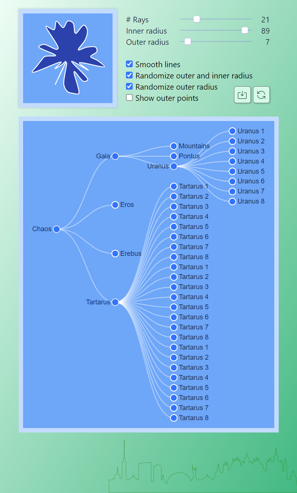
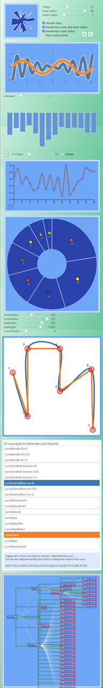

#### About

Coexistence of React with D3.js

#### Roadmap
    [ ] App
        [ ] zustand state store
            [x] BarsChart
        [x] Global store persistence
    [ ] Charts
        [ ] BarsChart
            [ ] probably not recalculate the y domain when toggle functions
        [ ] FunChart
            [ ] fixed color for each function
            [ ] take up less space for checkboxes

#### Links, Refs, Credits

* d3-random
    * [d3-random](https://github.com/d3/d3-random)
    * [random-source](https://observablehq.com/@d3/random-source)
    * [seedrandom](https://github.com/davidbau/seedrandom)

* d3-hierarchy
    * [collapsible-tree](https://observablehq.com/@d3/collapsible-tree)

* funplot    
    [funplot](https://observablehq.com/@mbostock/funplot)
    [sine-cosine](https://observablehq.com/@mbostock/sine-cosine)

* Charts
    [d3-shape](https://observablehq.com/@d3/learn-d3-shapes?collection=@d3/learn-d3#:~:text=Computing%20arc%20angles)
    [D3 v5 Line Chart](https://bl.ocks.org/gordlea/27370d1eea8464b04538e6d8ced39e89)

* Curves
    [D3 curve explorer](https://bl.ocks.org/d3indepth/raw/b6d4845973089bc1012dec1674d3aff8/)

* Custom UI
    [checkbox](https://codepen.io/enbee81/pen/oNWZBbb)